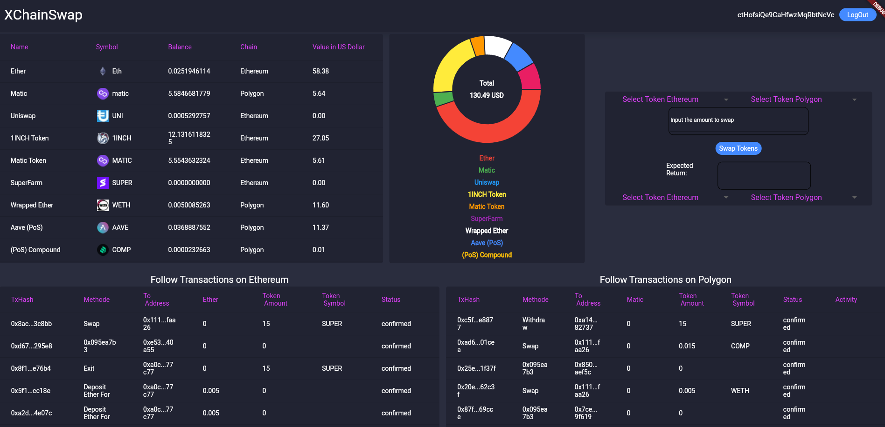

# XChainswap

XChainswap is the prototype of a DeFi Frontend where it is possible to swap and trace all you funds across different blockchains. At the moment ethereum und polygon blockchain are include. Binancechain may follow. To see the application in action please use this link

https://drive.google.com/drive/folders/1rTu8LJScxx9SZpRcmjpusu-lvLtiGALV
